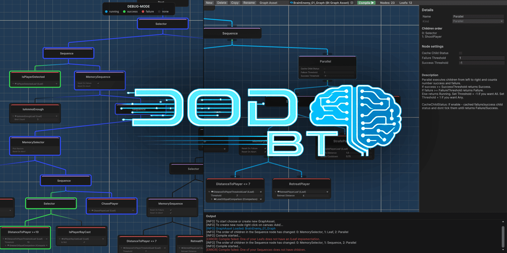
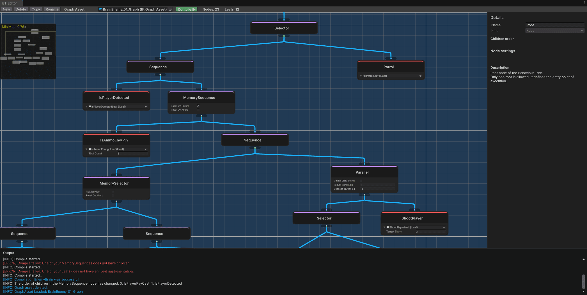
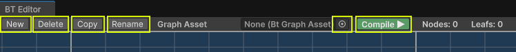
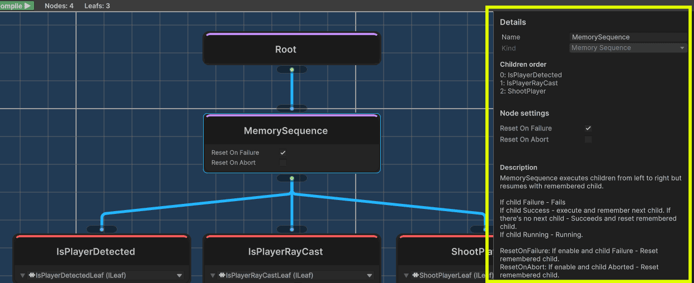
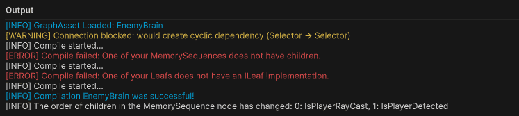
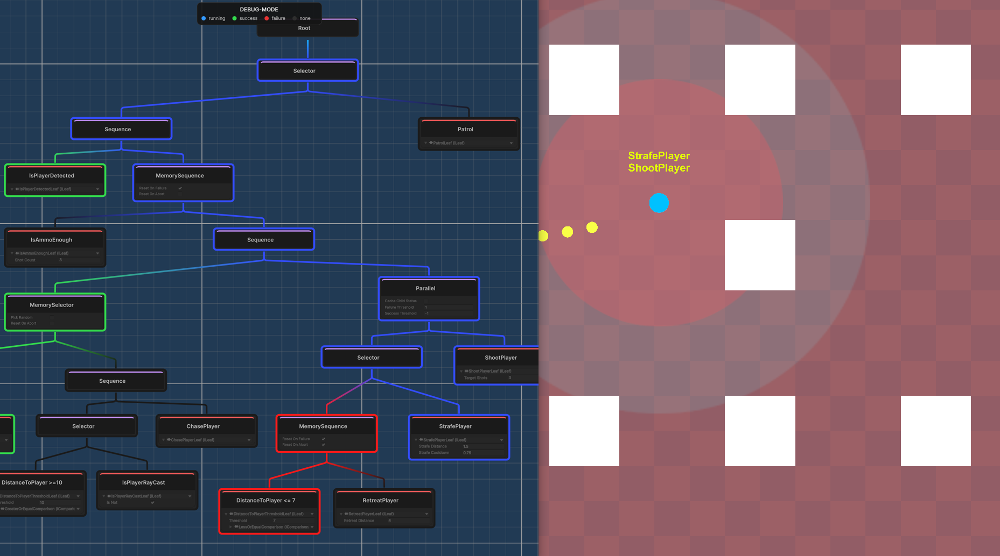
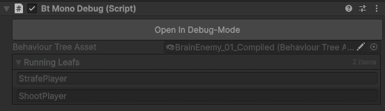

<p align="center">
  <a href="README.en.md">English</a> |
  <a href="README.md">Русский</a>
</p>

## 10⭐ Почему DODBT? (Data-oriented design Behaviour Tree)

⭐ **0 MonoBehaviour**  
Полностью отвязан от жизненного цикла Unity.

⭐ **0 runtime-аллокаций**  
Предсказуемая работа без GC.

⭐ **1 shared BT на N агентов**  
Архитектура, оптимизированная по памяти.

⭐ **Debug-режим в runtime**  
Чистая и удобная отладка.

⭐ **Полноценный редактор Графов BT**  
Логи, подсказки и наглядная визуализация.

⭐ **Граф и Runtime разделены**  
Граф компилируется в компактный и производительный BT.  
В билд не попадают ни данные о графе, ни editor-инструменты.

⭐ **BT это decision-layer**  
Дерево тикает только выбор/смену поведения.  
BT можно обновлять с любой частотой раз в N секунд.

⭐ **Отказ от Blackboard**  
Зависимости передаются напрямую, через DI или ServiceLocator.

⭐ **ECS-friendly**  
Отличная совместимость с ECS-архитектурой.

⭐ **Production-ready**  
Геймдизайнер настраивает BT без необходимости обращаться к коду.

> ⚠ **ВАЖНО!** Для доступа к `EDITOR` и `DEBUG` инструментам необходимо установить плагин `Odin Inspector`. Весь остальной функционал (в том числе в билде) будет работать без плагина, т.е. `Odin Inspector` необходимо и достаточно иметь только геймдизайнеру.

> ⚠ **ВАЖНО!** DODBT протестирован на версиях `UNITY 6000.051f1` и `Odin Inspector 4.0`. Нет гарантий того что это будет работать на более ранних версиях.

> ⚠ **ВАЖНО!** DODBT разрабатывался "для себя", а также находится в раннем доступе. Плагином уже можно комфортно пользоваться, но на данный момент продолжается доработка, улучшение и поиск ошибок.

> ⚠ **ВАЖНО!** Для DOTS разрабатывается отдельная версия плагина с поддержкой BlobAsset и Burst. Однако вы можете использовать и данную версию, если вас устраивает размещение BT и состояний в managed runtime как decision layer на main thread с обновлением дерева раз в N секунд.

<p align="center">
  
</p>

## 📑 Содержание

- [Установка](#установка)
- [Начало работы](#начало-работы)
- [Редактор графов](#редактор-графов)
- [Компиляция и сборка](#компиляция-и-сборка)
- [Дебаг режим](#дебаг-режим)
- [Проект для примера](#проект-для-примера)
- [Публичные классы и методы](#публичные-классы-и-методы)

## Установка
- **В виде unity-модуля**: Window → Package Manager → Install package from git URL:
- **Последняя версия**:
```
https://github.com/vadimburym/DODBT.git?path=/source
```
- **Стабильная версия** `РЕКОМЕНДУЕТСЯ`:
```
https://github.com/vadimburym/DODBT.git?path=/source#v0.1.0-early
```
- **В виде исходников**: код также может быть склонирован или получен в виде архива

## Начало работы

- **Создайте per-agent контекст**: `class` внешний runtime-контекст агента в котором работает BT.
> **[ПРИМЕР]** Пример контекста для `LeoEcsLite`.
```c#
public sealed class LeoEcsContext
{
    public int AgentIndex = -1;
}
```
- **Создайте per-leaf состояние**: `struct` состояние leaf-нод для конкретного агента.
> **[ПРИМЕР]** Пример состояния для `LeoEcsLite`.
```c#
[Serializable]
public struct LeoEcsLeafState
{
    public int StateIndex;
    public void Reset() => StateIndex = -1;
}
```
- **Создайте листья**: конечные узлы BT, которые могут быть проверками условий, конкретными действиями или состояниями, выполняемые в контексте агента и обладающие собственным состоянием выполнения. Создайте их наследуя от `ILeaf<контекст, состояние>` в любом месте проекта - `Odin Inspector` сам их найдет и предложит в качестве выбора в редакторе графов. Добавьте аттрибут `[Serializable]` и обозначьте `[SerializeField]` параметры, которые вы хотите редактировать из графа.
> **[ПРИМЕР]** Пример листа "Выстрели N раз в игрока" для `LeoEcsLite` с использованием `DI`. Лист не тикает поведение агента - он лишь добавляет/убирает у него состояние. Поведение тикают отдельные ECS-системы с фильтром по добавленному состоянию.
```c#
[Serializable]
public sealed class ShootPlayerLeaf : ILeaf<LeoEcsContext, LeoEcsLeafState>
{
    [SerializeField] private int _targetShots;
        
    private EcsWorld _world;
    private EcsPool<AgentEntity> _agentPool;
    private EcsPool<ShootEntityState> _shootStatePool;
    private EcsPool<PlayerVisibilitySensor> _sensorPool;
        
    [Inject]
    public void Construct(IEcsWorldsService service)
    {
        _world = service.GetWorld(EcsWorlds.BT_STATES);
        _agentPool = service.GetPool<AgentEntity>(EcsWorlds.BT_STATES);
        _shootStatePool = service.GetPool<ShootEntityState>(EcsWorlds.BT_STATES);
        _sensorPool = service.GetPool<PlayerVisibilitySensor>(EcsWorlds.DEFAULT);
    }

    public NodeStatus OnTick(LeoEcsContext context, ref LeoEcsLeafState state)
    {
        var status = _shootStatePool.Get(state.StateIndex).StateStatus;
        return status == NodeStatus.None ? NodeStatus.Running : status;
    }

    public void OnEnter(LeoEcsContext context, ref LeoEcsLeafState state)
    {
        var playerIndex = _sensorPool.Get(context.AgentIndex).DetectedPlayer;
        state.StateIndex = _world.NewEntity();
        _agentPool.Add(state.StateIndex).AgentIndex = context.AgentIndex;
        _shootStatePool.Add(state.StateIndex).Setup(
            targetShots: _targetShots,
            entityIndex: playerIndex);
    }

    public void OnExit(LeoEcsContext context, ref LeoEcsLeafState state, NodeStatus exitStatus)
    {
        _world.DelEntity(state.StateIndex);
    }

    public void OnAbort(LeoEcsContext context, ref LeoEcsLeafState state)
    {
        _world.DelEntity(state.StateIndex);
    }
}
```
> **[ПРИМЕР]** Пример листа "Виден ли игрок" для `LeoEcsLite` с использованием `DI`. Лист не несет ответственности за прямой рейкаст в игрока - он лишь проверяет значение, которым обладает сенсор, а сенсор уже сам решает с какой частотой и как его обновлять.
```c#
[Serializable]
public sealed class IsPlayerRayCastLeaf : ILeaf<LeoEcsContext, LeoEcsLeafState>
{
    private EcsPool<PlayerVisibilitySensor> _sensorPool;
        
    [Inject]
    public void Construct(IEcsWorldsService service)
    {
        _sensorPool = service.GetPool<PlayerVisibilitySensor>(EcsWorlds.DEFAULT);
    }

    public NodeStatus OnTick(LeoEcsContext context, ref LeoEcsLeafState state)
    {
        return _sensorPool.Get(context.AgentIndex).IsPlayerRaycast ? NodeStatus.Success : NodeStatus.Failure;
    }

    public void OnEnter(LeoEcsContext context, ref LeoEcsLeafState state) { }
    public void OnExit(LeoEcsContext context, ref LeoEcsLeafState state, NodeStatus exitStatus) { }
    public void OnAbort(LeoEcsContext context, ref LeoEcsLeafState state) { }
}
```

## Редактор графов

<p align="center">
  
</p>

> ⚠ **ВАЖНО!** Данный модуль работает только при наличии плагина `Odin Inspector`.

- **Откройте редактор графов**: Tools → VadimBurym → BT Editor.



- **Верхняя панель**: Кнопки слева направо: `Создать новый ассет графа` | `Удалить текущий ассет` | `Создать новый ассет - копию текущего` | `Переименовать текущий ассет` | `Выбрать ассет` | `Скомпилировать текущий граф в BT ассет`. Все ассеты попадают в папку Assets/VadimBurym-DODBT, откуда вы можете переместить их в удобное для вас место. Создайте новый ассет графа.


- **Канвас**: Нажмите ПКМ/Add/... чтобы создать новую ноду. Порядок выполнения дочерних нод у композитов определяется слева направо. Соберите граф поведения из выпадающих нод из списка и созданных вами листьев.
- **Боковая панель**: Панель `Details` отображает информацию о выделенной ноде. Здесь вы можете изменить имя ноды, сверить порядок выполнения дочерних нод, редактировать настройки ноды, а также посмотреть описание того как именно работает нода.

> ⚠ **ВАЖНО!** Как говорил уважаемый AI Lead одного AAA-проекта, декораторы это костыли в мире Behaviour Tree и он старается не использовать их в своих деревьях. Я с ним согласен и т.к. плагин разрабатывался "для себя" декораторов пока что нет. Ноды существующие на данный момент: `Selector`, `Sequence`, `MemorySelector`, `MemorySequence`, `Parallel`. Из них уже можно собрать практически любой BT, но это не отменяет того, что в далеком или ближайшем будущем понемногу будут добавляться различные декораторы, если в этом будет потребность от аудитории. Но на данный момент их нет.

> ⚠ **ВАЖНО!** Ограничение по количеству дочерних нод у одного композита = `127`. Ограничение по количеству нод в BT = `65535`. Если вы уверены что у вас будет <= `255` нод в каждом BT, можете добавить `DODBT_SMALL_SIZE` в список директив компилятора, чтобы немного оптимизировать память.


- **Нижняя панель**: Панель `Outputs` отображает различные логи. Здесь могут быть причины неудачной компиляции графа, предупреждения о циклических зависимостях, а также уведомления о изменении порядка дочерних нод у композитов.

## Компиляция и сборка

- **Скомпилируйте граф**: Нажмите на кнопку компиляции на верхней панеле, чтобы получить скомпилированный `BehaviourTreeAsset` (не путать с ассетом графа). Положите скомпилированный ассет в удобное для вас место, к которому можно обратиться из кода.
- **Создайте для каждого BT-ассета runtime-BT**: Соберите все ваши `BehaviourTreeAsset` и создайте для каждого `BehaviourTree`.
> ⚠ **ВАЖНО!** Это делается 1 раз перед началом игры.

> **[ПРИМЕР]** Пример создания runtime-BT из скомпилированного BT-ассета для предыдущих примеров.
```c#
var btAsset = //Ссылка на ваш BehaviourTreeAsset
var runtimeBt = new BehaviourTree<LeoEcsContext, LeoEcsLeafState>();
runtimeBt.Construct(asset);
```
- **Прокиньте зависимости каждому листу у каждого runtime-BT**: Соберите листья, используя DI контейнер или ServiceLocator.
> ⚠ **ВАЖНО!** Это делается 1 раз перед началом игры.

> **[ПРИМЕР]** Пример для `DI`.
```c#
var leafs = runtimeBt.Leafs;
for (int i = 0; i < leafs.Length; i++)
    _diContainer.Inject(leafs[i]); //Ваш DIContainer
```
> **[ПРИМЕР]** Пример для `ServiceLocator`.
```c#
var leafs = runtimeBt.Leafs;
for (int i = 0; i < leafs.Length; i++)
    if (leafs[i] is IConstruct constructable) //Реализуйте листьям контракт IConstruct
        constructable.Construct(); //Собирайте листья внутри метода Construct
```
> **[ПРИМЕР]** Пример без `DI` или `ServiceLocator`: Собирайте и передавайте зависимости через ваш контекст.
```c#
public sealed class LeoEcsContext
{
    public int AgentIndex = -1;
    public EcsPool<Component1> PoolC1;
    public EcsPool<Component2> PoolC2;
    public IService1 Service1;
}
```
- **Соберите контекст и состояния агентов**: В вашем месте сборки агентов создайте для каждого контекст и состояние `BtState`. Инициализируйте состояние от желаемого `BehaviourTree`.
> **[ПРИМЕР]** Пример для каждого агента на `LeoEcsLite`. Над btContext и btState рекомендуется сделать MemoryPool и брать классы из пула.
```c#
var btContext = new LeoEcsContext();
var btState = new BtState<LeoEcsLeafState>();
runtimeBt.FillInitialState(btState);
for (int i = 0; i < btState.LeafStates.Length; i++)
    btState.LeafStates[i].Reset();

var agent = _world.NewEntity();
btContext.AgentIndex = agent;
```
- **Тикайте runtime-BT**: Тикайте каждого агента через его `BehaviourTree` с угодной вам частотой.
> ⚠ **ВАЖНО!** Не создавайте для каждого агента отдельный `BehaviourTree`. На каждый BT-asset создается только один runtime-BT. Для каждого агента создается только контекст и его состояние дерева.
```c#
runtimeBt.Tick(btContext, btState);
```

## Дебаг режим

<p align="center">
  
</p>

> ⚠ **ВАЖНО!** Данный модуль работает только при наличии плагина `Odin Inspector`.

- **Добавьте отладку для вашего агента**: Добавьте компонент `BtMonoDebug` и свяжите его с конкретным BT-ассетом и ссылкой на состояние агента.
<p align="center">
  
</p>

```c#
#if UNITY_EDITOR
_btMonoDebug.Construct(btAsset, btState);
#endif
```
- **Откройте Debug-Mode**: Дебаг-режим открывает граф и окрашивает ноды в текущее состояние конкретного агента: `зеленый - success`, `красный - failure`, `синий - running`, `серый - none`. Также BtMonoDebug предоставляет публичное поле `RunningLeafs`, которое можно использовать в своих интересах, например для вывода текущих running-leafs в качестве текста возле каждого агента.

## Проект для примера

В ветке `example-project` лежит проект с использованием данного плагина, разработанный чтобы показать как он устроен. Проект основан на `LeoEcsLite`. Здесь вы можете запустить игровую сцену и полноценно посмотреть как работает Debug-mode, как выглядит граф, как проходит этап сборки и внедрение в runtime на готовом примере.

## Публичные классы и методы

| **Класс/Структура/Интерфейс** | **Метод/Поле** | **Описание** |
|------------|------------|-----------------|
| class `BehaviourTree` <TContext, TLeafState> |  | runtime-BT, создается ровно 1 экземпляр для каждого скомпилированного BT-ассета перед началом игры. TContext - ваш контекст BT для каждого агента. TLeafState - ваше состояние для каждого листа |
|  | ILeaf[] `Leafs` | Список всех листьев инициализированного runtime-BT. Нужен для сборки листьев через DIContainer или ServiceLocator |
|  | void `Construct`( BehaviourTreeAsset) | Инициализирует runtime-BT BT-ассетом |
|  | void `FillInitialState`( BtState< TLeafState>) | Заполняет BtState начальным значением, характерным для данного runtime-BT |
|  | void `Tick`(TContext, BtState< TLeafState>) | Тикает runtime-BT для конкретного агента начиная с root-ноды |
|  | void `Abort`(TContext, BtState< TLeafState>) | Абортит runtime-BT для конкретного агента начиная с root-ноды |
| class `BehaviourTreeAsset` |  | BT-ассет, создается путем компиляции граф-ассета через BT Editor |
|  | string `GUID` | Уникальный глобальный идентификатор |
| class `BtMonoDebug` |  | MonoBehaviour отвечающий за дебаг-состояние агента. Editor-only |
|  | void `Construct`( BehaviourTreeAsset, IBtDebugState) | Инициализирует дебаг конкретным ассетом и состоянием BtState конкретного агента |
|  | IReadOnlyList< string> `RunningLeafs` | Список имен текущих листьев, имеющих статус Running |
| struct `BtState`< TLeafState> |  | Данные о состоянии runtime-BT для одного агента |
|  | TLeafState[] `LeafStates` | Список ваших состояний листьев. Нужно если требуется вручную делать Reset или т.п. этих состояний |
| interface `ILeaf`<in TContext, TLeafState> |  | Интерфейс для создания своих листьев в вашем контексте с вашим состоянием листа |
| interface `ILeaf` |  | Пустой маркер для определения всех листьев. В разработке не понадобится |
| interface `IBtDebugState` |  | Интерфейс для определения дебаг-состояния. Его реализует BtState. В разработке не понадобится. Editor-only |
| enum `NodeStatus` |  | Статус ноды |