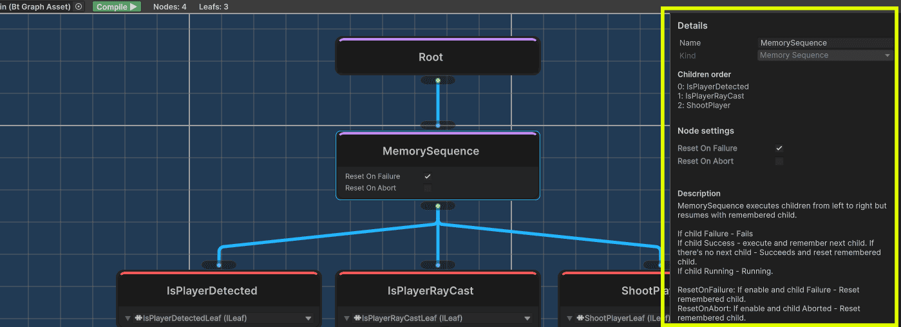
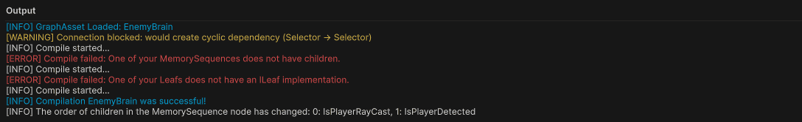

## 10⭐ Почему DODBT? (Data-oriented design Behaviour Tree)

⭐ **0 MonoBehaviour**  
Полностью отвязан от жизненного цикла Unity.

⭐ **0 runtime-аллокаций**  
Предсказуемая работа без GC.

⭐ **1 экземпляр BT на N агентов**  
Архитектура, оптимизированная по памяти.

⭐ **Debug-режим в runtime**  
Чистая и удобная отладка.

⭐ **Полноценный редактор Графов BT**  
Логи, подсказки и наглядная визуализация.

⭐ **Граф и Runtime разделены**  
Граф компилируется в компактный и производительный BT.  
В билд не попадают ни данные о графе, ни editor-инструменты.

⭐ **BT отвечает только за выбор поведения**  
Дерево не тикает само поведение.  
BT можно обновлять с любой частотой (например, раз в N секунд).

⭐ **Отказ от Blackboard**  
Зависимости передаются напрямую через DI или ServiceLocator.

⭐ **ECS-friendly**  
Отличная совместимость с ECS-архитектурой.

⭐ **Production-ready**  
Геймдизайнер настраивает BT без необходимости обращаться к коду.

> ⚠ **ВАЖНО!** Для доступа к `EDITOR` и `DEBUG` инструментам необходимо установить плагин `Odin Inspector`. Весь остальной функционал (в том числе в билде) будет работать без плагина, т.е. `Odin Inspector` необходимо и достаточно иметь только геймдизайнеру.

> ⚠ **ВАЖНО!** DODBT протестирован на версиях `UNITY 6000.051f1` и `Odin Inspector 4.0`. Нет гарантий того что это будет работать на более ранних версиях.

> ⚠ **ВАЖНО!** DODBT находится в раннем доступе. Плагином уже можно комфортно пользоваться, но на данный момент продолжается доработка, улучшение и поиск ошибок.

## 📑 Содержание

- [Установка](#установка)
- [Начало работы](#начало-работы)
- [Редактор графов](#редактор-графов)

## Установка
- **В виде unity-модуля (рекомендуется)**: Window → Package Manager → Install package from git URL:
```
https://github.com/vadimburym/DODBT.git?path=/source
```
- **В виде исходников**: код также может быть склонирован или получен в виде архива

## Начало работы

- **Создайте per-agent контекст**: `class` внешний runtime-контекст агента в котором работает BT.
> **[ПРИМЕР]** Пример контекста для LeoEcsLite.
```c#
public sealed class LeoEcsContext
{
    public int AgentIndex = -1;
}
```
- **Создайте per-leaf состояние**: `struct` состояние leaf-нод для конкретного агента.
> **[ПРИМЕР]** Пример состояния для LeoEcsLite.
```c#
[Serializable]
public struct LeoEcsLeafState
{
    public int StateIndex;
    public void Reset() => StateIndex = -1;
}
```
- **Создайте листья**: конечные узлы BT, которые могут быть проверками условий, конкретными действиями или состояниями, выполняемые в контексте агента и обладающие собственным состоянием выполнения. Создайте их наследуя от `ILeaf<контекст, состояние>` в любом месте проекта - `Odin Inspector` сам их найдет и предложит в качестве выбора в редакторе графов. Добавьте аттрибут `[Serializable]` и обозначьте `[SerializeField]` параметры, которые вы хотите редактировать из графа.
> **[ПРИМЕР]** Пример листа "Выстрели N раз в игрока" для LeoEcsLite с использованием DI. Лист не тикает поведение агента - он лишь добавляет/убирает у него состояние. Поведение тикают отдельные ECS-системы с фильтром по добавленному состоянию.
```c#
[Serializable]
public sealed class ShootPlayerLeaf : ILeaf<LeoEcsContext, LeoEcsLeafState>
{
    [SerializeField] private int _targetShots;
        
    private EcsWorld _world;
    private EcsPool<AgentEntity> _agentPool;
    private EcsPool<ShootEntityState> _shootStatePool;
    private EcsPool<PlayerVisibilitySensor> _sensorPool;
        
    [Inject]
    public void Construct(IEcsWorldsService service)
    {
        _world = service.GetWorld(EcsWorlds.BT_STATES);
        _agentPool = service.GetPool<AgentEntity>(EcsWorlds.BT_STATES);
        _shootStatePool = service.GetPool<ShootEntityState>(EcsWorlds.BT_STATES);
        _sensorPool = service.GetPool<PlayerVisibilitySensor>(EcsWorlds.DEFAULT);
    }

    public NodeStatus OnTick(LeoEcsContext context, ref LeoEcsLeafState state)
    {
        var status = _shootStatePool.Get(state.StateIndex).StateStatus;
        return status == NodeStatus.None ? NodeStatus.Running : status;
    }

    public void OnEnter(LeoEcsContext context, ref LeoEcsLeafState state)
    {
        var playerIndex = _sensorPool.Get(context.AgentIndex).DetectedPlayer;
        state.StateIndex = _world.NewEntity();
        _agentPool.Add(state.StateIndex).AgentIndex = context.AgentIndex;
        _shootStatePool.Add(state.StateIndex).Setup(
            targetShots: _targetShots,
            entityIndex: playerIndex);
    }

    public void OnExit(LeoEcsContext context, ref LeoEcsLeafState state, NodeStatus exitStatus)
    {
        _world.DelEntity(state.StateIndex);
    }

    public void OnAbort(LeoEcsContext context, ref LeoEcsLeafState state)
    {
        _world.DelEntity(state.StateIndex);
    }
}
```
> **[ПРИМЕР]** Пример листа "Виден ли игрок" для LeoEcsLite с использованием DI. Лист не несет ответственности за прямой рейкаст в игрока - он лишь проверяет значение, которым обладает сенсор, а сенсор уже сам решает с какой частотой и как его обновлять.
```c#
[Serializable]
public sealed class IsPlayerRayCastLeaf : ILeaf<LeoEcsContext, LeoEcsLeafState>
{
    private EcsPool<PlayerVisibilitySensor> _sensorPool;
        
    [Inject]
    public void Construct(IEcsWorldsService service)
    {
        _sensorPool = service.GetPool<PlayerVisibilitySensor>(EcsWorlds.DEFAULT);
    }

    public NodeStatus OnTick(LeoEcsContext context, ref LeoEcsLeafState state)
    {
        return _sensorPool.Get(context.AgentIndex).IsPlayerRaycast ? NodeStatus.Success : NodeStatus.Failure;
    }

    public void OnEnter(LeoEcsContext context, ref LeoEcsLeafState state) { }
    public void OnExit(LeoEcsContext context, ref LeoEcsLeafState state, NodeStatus exitStatus) { }
    public void OnAbort(LeoEcsContext context, ref LeoEcsLeafState state) { }
}
```

## Редактор графов

> ⚠ **ВАЖНО!** Данный модуль работает только при наличии плагина `Odin Inspector`.

- **Откройте редактор графов**: Tools → VadimBurym → BT Editor.



